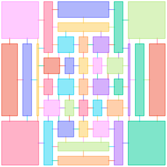
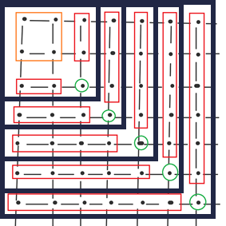

# TNproject

This project aim to find the best coding way to build machine learning model based on TensorNetwork.

It consist of two part:

- The benchmark for different method and backend.
- The built simple machine learning model

## Benchmark

### [Batch Contraction method](https://github.com/veya2ztn/TNproject/tree/main/benchmark/BatchContraction)

- Loop
- Batched TensorNetwork
- Efficient Coding

### [Optimized contraction Path](https://github.com/veya2ztn/TNproject/tree/main/benchmark/ContractionPath)

- opt_path
- line by line
- corner fold
- renormalization group

### [Optimized contraction efficiency](https://github.com/veya2ztn/TNproject/tree/main/benchmark/ContractionEngine)

- [tensornetwork](https://github.com/google/TensorNetwork)

- [opt_einsum](https://github.com/dgasmith/opt_einsum)

- [opt_einsum_torch](https://github.com/PyTorch/PyTorch/tree/heitorschueroff/einsum%2Foptimize)

## Data Preprocess

Here we test our model on the MNIST and FashionMNIST dataset. 

The input data is $(B,1,28,28)$ dense tensor. 

Usually, our TensorNetwork engine can only handle size smaller than $10\times10$. So we would transform the original tensor to small size. There are two way:

-  `Group divide`: divide $28\times 28$ to $7\times7$ by grouping every $4\times4$ pixels. 

  This will transform the input from  $(28,28)$  to  a $7\times7$ network with each unit tensor is $(16)$ .

  Such a division is just like merge the original $4\times4$ part(16 tensors) into one big tensor. Notice, other implements like [Pan Z.](https://journals.aps.org/prb/abstract/10.1103/PhysRevB.103.125117) will treat every single unit as a $(2,)$ Tensor $[x,1-x]$. Then the merged input unit become $2^{16}$ size.  

- `CNN feature`: apply a CNN block with double $3\times 3$ filter, than get a abstract feature $(\text{Outchannel},7,7)$. 

For MNIST dataset, the outer-circle is almost 0. In  `Group divide` scenario, it may heavily destroy the number normalization. So we commend use the center-clip $24\times24 $ and then group to $8\times 8$ or $6\times6$

## Model 

Notice, we don't use any approximation like truncated SVD in [Pan Z.](https://journals.aps.org/prb/abstract/10.1103/PhysRevB.103.125117) So the gradient 

- Hyper linear Network

  - Regular Rectangle Network

  - Arbitrary Connection Network and Arbitrary Shape Network

    Since there is no constrain about what should a tensor network looks like, it could be any shape with any bond dimension. A diagram show below. For the information dense region, we may give more tensor unit and larger bond dimension. For the less-important region, we can reduce the dimension and tensor numbers. It is expected  that a right architect will help reduce computing source and raise accuracy. 

  

  - Nonlinear interaction deep layer.

    The corner method will contracting tensor from corner to center, for each big step, it would contract 3+1 part of the input. This can map to the represent order of a centralized image. So for each part step, we can apply a nonlinear layer.  

    

## Ongoing Problem

- What is the best structure of a  hyper-linear layer
- The amplifier variation -- hyper sensitivity initial.