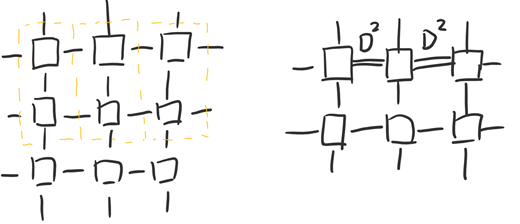

### The contraction Path

We focus on 2D TensorNetwork contraction in this part.

 

There are many ways to contract thus 'hyper-complex' tensor network. 

All the contracting would face the `bond dimenstion explore` problem. 

And choose a fast and memory saving method is very important.

We would test follow:

- use the optimized path calculated from `opt_einsum` (`randomSample` for 100 times)
- Corner fold method for symmetry Network
- Renormalization Group method without truncation. 
- Line contraction from boundary to center.

For detail part, can check our paper (coming soon)

For any point missing, it is mean out of memory.

The hyperparameter is the size of network $L$ , the virtual bond dimension $V$. 

The batch $B=1$ and the influence for big batch is linear. 

------

Replicate the result by `python benchmark.py` 

Notice: The result is tested on the A100-40G GPU, which get a lager GPU memory (40G). 

